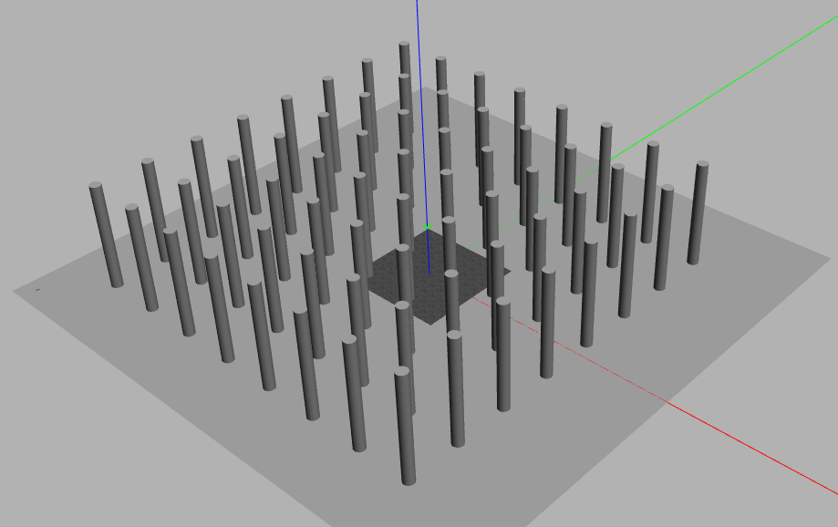
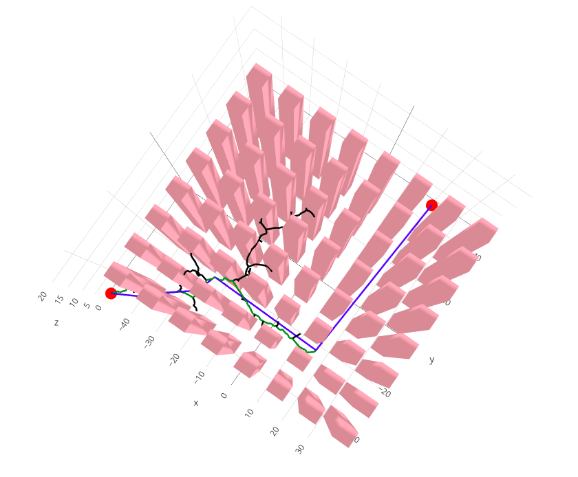

# Iris Quadcopter Simulation
**Yuchen Wang**

*Northwestern University*


## Introduction
This main goal of this project is to simulate the behavior of an Iris quadcopter based on PX4 firmware in a Gazebo world. The quadcopter is supposed to accomplish an 3D motion planning. At first, the quad will be given a map containing all the obstacles and a destination point. It will use RRT algorithm to generate an optimized path to reach the goal and avoid collisions. The whole motion of the drone should be smooth, safe and robust.
Other than that, the quad could also be manipulated by hand-gesture to navigate in complex aerial space.


## Background
### PX4
[PX4](https://github.com/PX4/Firmware) is the autopilot control platfrom used in this project. It establishes the connection between ROS and Gazebo simulation via MAVROS. PX4 supports both Software In the Loop (SITL) simulation, where the flight stack runs on computer (either the same computer or another computer on the same network) and Hardware In the Loop (HITL) simulation using a simulation firmware on a real flight controller board.

### MAVROS--MAVLink
[MAVROS](https://github.com/mavlink/mavros) is a ROS package which provides communication driver for various autopilots with MAVLink communication protocal. MAVROS can be used to communicate with any MAVLink enabled autopilot, and for this specific project it will be only used to enable communication between the PX4 flight stack and a ROS enabled companion computer.

### ROS with Gazebo
ROS can be used with PX4 and the Gazebo simulator. As the picture below indicates, PX4 communicates with Gazebo to receive sensor data from the simulated world and send motor and actuator values. It communicates with the GCS and ROS to send telemetry from the simulated environment and receive commands.


*[http://dev.px4.io/en/simulation/ros_interface.html]*

## Nodes
### RRT
`rrt.py` is to generate the 3D obstacle-free path for the quad using RRT algorithm.

[Here](https://plot.ly/~yuchnw/5/#/) is the link to the 3D RRT path planning result generated using Plotly library. Currently I am using a simple Gazebo world map with a few buildings and convert them into block obstacles. The overview of the result is shown below:




After getting a feasible path(*the green one*), I smoothed it to reduce the number of waypoints(*the blue one*). Generally, since the feasible path has been generated from the RRT-grown tree, and it consists of a chain of nodes connections, the optimization process is conducted by randomly picking up two nodes from the feasible path, and trying to connect them directly.

Here is the result of the [Optimized Path](https://plot.ly/~yuchnw/11/#/). It takes a more complicated obstacle environment and applies the RRT algorithm. The feasible path has 102 waypoints and the number was reduced to 8 after optimization.

### Pilot
`setMode.py` is to control the flying mode of the quad. For now it can **arm**, **disarm**, **takeoff**, **land** the quadcopter and return its geographic coordinates.
Also, the **setLocation** command can take the path generated by `map.py` using RRT algorithm, and let the quad fly following the path.


Click [here](https://www.youtube.com/watch?v=zPKlL9mI_Lc) to view the full demo video of current progress.

### Tracking
`detectHand.py` integrates computer vision and PX4 autopilot together. This part can be divided into two sections.

First, I used ASUS Xtion Pro **RGBD** camera and OpenCV to track my hand's movement and find the farthest fingertip. As my hand moves, the fingertip will create a path that could be used as the desired trajectory for the quad in Gazebo. Since the lightning condition and different skin color would affect the tracking performance a lot, **skin color histogram** is a useful technique here. The program is taking 1000 skin color samples from the user’s hand and then creates a histogram, using the ROI matrix for the skin color and normalizing this matrix. Then OpenCV will take this histogram to seperate the hand feature from the image and apply the skin color to the frame. After that, I find the max contour and calculat the centroid and farthest point from the centroid (which is the longest fingertip).

Here is the demo of the fingertip tracking result: (to keep the frame clean, only the last 20 fingertip trace would be displayed on the screen)


After getting the X-Y coordinate of the fingertip through the RGB image layer, I calibrated it with the depth image layer where could return the distance between the fingertip and the lense. Then I synced the **X-Y-Z** trajectory generated by hand detection to the PX4 pilot program, considering the trace of fingertip as waypoints for the quadcopter. The result could be seen at top.

## Important Tip
### Offboard Mode Setup
The flight controller needs a stream of setpoint messages before the commander accepts offboard mode. Make sure the flight controller gets a stream of setpoints (0.5s timeout) before you switch to offboard mode. The system will reject offboard otherwise.

## Installation
### Prerequisite
The system should have ROS(*Indigo, Kinetic, Lunar or Melodic*), relative workspace and Gazebo(*8 or later*) installed. The hardware device required is an RGBD camera. I use ASUS Xtion Pro.

### Install PX4 Firmware
Fork from PX4 [Git repo](https://github.com/PX4/Firmware) and clone it to local working directory. Build the platform with following commands:
```bash
cd <Firmware_clone>
make px4_sitl_default gazebo
source ~/catkin_ws/devel/setup.bash    // (optional)
source Tools/setup_gazebo.bash $(pwd) $(pwd)/build/px4_sitl_default
export ROS_PACKAGE_PATH=$ROS_PACKAGE_PATH:$(pwd)
export ROS_PACKAGE_PATH=$ROS_PACKAGE_PATH:$(pwd)/Tools/sitl_gazebo
roslaunch px4 mavros_posix_sitl.launch
```
It will launch both SITL and MAVROS in ROS.

### Install MAVROS Package
:bangbang: **In case of getting errors about dependencies and building packages, run `rosdep update` and `sudo apt-get update` often.** :bangbang:

Build the package with following commands:
```bash
cd ~/catkin_ws
# 1. Install MAVLink:
rosinstall_generator --rosdistro melodic mavlink | tee /tmp/mavros.rosinstall

# 2. Install MAVROS:
rosinstall_generator --upstream mavros | tee -a /tmp/mavros.rosinstall

# 3. Create workspace & dependencies:
wstool merge -t src /tmp/mavros.rosinstall
wstool update -t src -j4
rosdep install --from-paths src --ignore-src -y

# 4. Install GeographicLib datasets:
sudo ./src/mavros/mavros/scripts/install_geographiclib_datasets.sh

# 5. Build source
catkin build
source devel/setup.bash
```
:bangbang: **MAVROS only support `catkin build` instead of `catkin_make` otherwise it will raise an error saying "Workspace contains non-catkin packages".** :bangbang:

### Install OpenNi
This package contains launch files for using OpenNI-compliant devices such as the ASUS Xtion Pro in ROS. It creates a nodelet graph to transform raw data from the device driver into point clouds, disparity images, and other products suitable for processing and visualization.

```bash
# 1. To start OpenNi:
roslaunch openni_launch openni.launch

# 2. To visualize in Rviz:
rosrun rviz rviz

# 3. To view the color image from the RGB camera outside of rviz:
rosrun image_view image_view image:=/camera/rgb/image_color

# 4. To view the depth image from the D-cam:
rosrun image_view image_view image:=/camera/depth/image_raw
```

## Run
To execute the program, following the steps below:
```bash
roscore
roslaunch px4 mavros_posix_sitl.launch

# For autonomous path planning
rosrun iris_sim map.py # Generate path using RRT
rosrun iris_sim setMode.py
# First set Mode 1 to arm the quadcopter
# Then set Mode 5 to start flying along the path

# For hand-gesture tracking
roslaunch openni_launch openni.launch
rosrun iris_sim detectRGBD.py # Launch hand detection script
# Put hand in the green rectangles and press 'z' to apply histogram mask
# When the detection succeeds, press 'a' to start tracking fingertip
rosrun iris_sim setMode.py
# First set Mode 1 to arm the quadcopter
# Then set Mode 6 to follow the fingertip trajectory
```

## Strench Goal
The further step would be deploy the whole program to a real quadcopter and test it. Stay tuned.